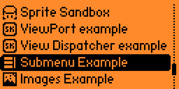

# Applications for Flipper Zero

These are applications for the [Flipper Zero][f0] for me to experiment with
code.

# List of Applications

* `images_example`: Example application with images and animations
* `led_rainbow`: Loop the Flipper Zero LED through every color
* `sprite_sandbox`: Experimenting with images/sprites
* `submenu_example`: Example application which uses a menu to select views
* `viewport_example`: Example application which uses a single viewport
* `view_dispatcher_example`: Example application which uses a view dispatcher

# Screenshots




# Setup

[Install the latest official firmware][f0-update] on your Flipper Zero device.

Clone the official [Flipper Zero firmware repository][f0-firmware-repo], and
check out the version tag for the currently released firmware version:

```shell
git clone https://github.com/flipperdevices/flipperzero-firmware
git checkout 0.74.2  # Use tag for latest official firmware release
```

Change to the firmware's `applications_user` subdirectory and clone this
repository:

```shell
cd applications_user
git clone https://github.com/smkent/f0-apps
```

# Usage

Replace `<my_app>` in the below commands with the ID of the application you want
to use (see "List of Applications" above).

All of these commands should be run in the `flipperzero-firmware` repository
root directory.

Compile only:

```shell
./fbt fap_<my_app>
```

Compile, copy to Flipper Zero via USB, and launch app:

```shell
./fbt launch_app APPSRC=<my_app>
```

Once launched, applications are available on the Flipper Zero within
`Applications` -> `smkent`.


[f0]: https://flipperzero.one
[f0-update]: http://update.flipperzero.one/
[f0-firmware-repo]: https://github.com/flipperdevices/flipperzero-firmware
